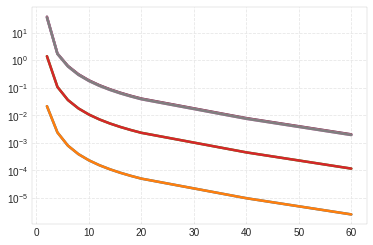
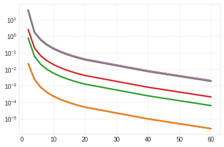

Example 5.8.1
=============

.. code:: ipython3

    import numpy as np
    import matplotlib.pyplot as plt
    import ross as rs

.. code:: ipython3

    steel = rs.materials.steel

.. code:: ipython3

    number_of_elements = [2, 4, 6, 8, 10, 12, 14, 16, 18, 20, 40, 60]

.. code:: ipython3

    def create_rotor(n_el):
        """Create example rotor with given number of elements."""
        shaft = [
            rs.ShaftElement(1.2/(n_el), i_d=0.03, o_d=0.08, material=steel)
            for i in range(n_el)
        ]
    
        disks = [
            rs.DiskElement.from_geometry(n=(n_el / 2), material=steel,
                                         width=0.08, i_d=0.08, o_d=0.4)
        ]
    
        bearings = [
            rs.BearingElement(0, kxx=1e15, cxx=0),
            rs.BearingElement(n_el, kxx=1e15, cxx=0)
        ]
        
        return rs.Rotor(shaft, disks, bearings, sparse=False)

.. code:: ipython3

    def analysis(speed):
        """Perform convergence analysis for a given speed."""
        # create reference rotor with 80 elements
        rotor_80 = create_rotor(80)
        rotor_80.w = speed
        rotor_80.run_modal()
    
        n_eigen = 8 
        errors = np.zeros([len(number_of_elements), n_eigen])
    
        for i, n_el in enumerate(number_of_elements):
            rotor = create_rotor(n_el)
            rotor.w = speed
            rotor.run_modal()
            errors[i, :] = abs(
                100 * (rotor.wn[:n_eigen] - rotor_80.wn[:n_eigen]) 
                / rotor_80.wn[:n_eigen])
            
        fig, ax = plt.subplots()
        for i in range(8):
            ax.semilogy(number_of_elements, errors[:, i])

.. code:: ipython3

    analysis(speed=0)

.. code:: ipython3

    analysis(speed=500)

