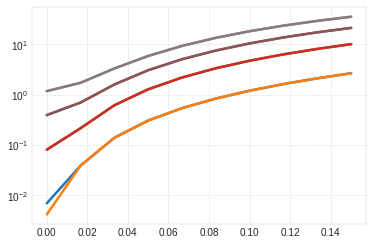

Example 2 - Effect of varying slenderness ratio
===============================================

In this example, we use the rotor seen in Example 5.8.2 from ‘Dynamics
of Rotating Machinery’ by MI Friswell, JET Penny, SD Garvey & AW Lees,
published by Cambridge University Press, 2010.

.. code:: ipython3

    import numpy as np
    import matplotlib.pyplot as plt
    import ross as rs

.. code:: ipython3

    steel = rs.materials.steel

.. code:: ipython3

    number_of_elements = [2, 3, 4, 5, 6, 7, 8]

.. code:: ipython3

    def create_rotor(n_el, R, shear_effects=False, rotary_inertia=False):
        """Create example rotor with given number of elements and R ration."""
        L_total = 1
        D = R * L_total
        
        shaft = [
            rs.ShaftElement(1./(n_el), i_d=0, o_d=D, material=steel,
                            shear_effects=shear_effects,
                            rotary_inertia=rotary_inertia)
            for i in range(n_el)
        ]
    
        bearings = [
            rs.BearingElement(0, kxx=1e15, cxx=0),
            rs.BearingElement(n_el, kxx=1e15, cxx=0)
        ]
        
        return rs.Rotor(shaft_elements=shaft, bearing_seal_elements=bearings, sparse=False)

.. code:: ipython3

    # create reference rotor with 80 elements
    R = 0.04
    rotor_80 = create_rotor(80, R)
    rotor_80.run_modal()
    
    n_eigen = 8 
    errors = np.zeros([len(number_of_elements), n_eigen])
    
    for i, n_el in enumerate(number_of_elements):
        rotor = create_rotor(n_el, R)
        rotor.run_modal()
        errors[i, :] = abs(
            100 * (rotor.wn[:n_eigen] - rotor_80.wn[:n_eigen]) 
            / rotor_80.wn[:n_eigen])
    
    fig, ax = plt.subplots()
    ax.set_xlabel('number of elements')
    ax.set_ylabel('Natural Frequency error(%)')
    for i in range(8):
        ax.semilogy(number_of_elements, errors[:, i])

.. image:: example_05_08_02_files/example_05_08_02_5_0.png

.. code:: ipython3

    # create reference rotor with 80 elements
    n_el = 6 
    R_list = np.linspace(1e-4, 0.15, 10)
    
    n_eigen = 8 
    errors = np.zeros([len(R_list), n_eigen])
    
    for i, R in enumerate(R_list):
        rotor_ref = create_rotor(100, R, 
                                 shear_effects=True, rotary_inertia=True)
        rotor_ref.run_modal()
    
        rotor = create_rotor(n_el, R)
        rotor.run_modal()
        errors[i, :] = abs(
            100 * (rotor.wn[:n_eigen] - rotor_ref.wn[:n_eigen]) 
            / rotor_ref.wn[:n_eigen])
    
    fig, ax = plt.subplots()
    ax.set_xlabel('Slenderness ratio')
    ax.set_ylabel('Natural Frequency error(%)')
    for i in range(8):
        ax.semilogy(R_list, errors[:, i])

