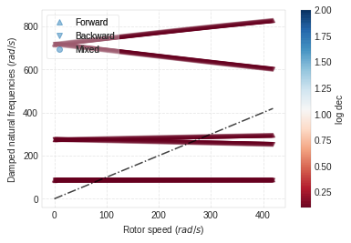

EXAMPLE 5.9.1.
==============

A 1.5-m-long shaft, has a diameter of 0.05 m. The disks are keyed to the
shaft at 0.5 and 1 m from one end. The left disk is 0.07 m thick with a
diameter of 0.28 m; the right disk is 0.07 m thick with a diameter of
0.35 m. For the shaft, :math:`E = 211 GN/m^2` and
:math:`G = 81.2 GN/m^2`. There is no internal shaft damping. For both
the shaft and the disks, :math:`\rho = 7,810 kg/m^3`. The shaft is
supported by identical bearings at its ends.

These bearings are isotropic and have a stiffness of 1 MN/m in both the
x and y directions. The bearings contribute no additional stiffness to
the rotational degrees of freedom and there is no damping or
cross-coupling in the bearings. Create an FE model of the shaft using
six Timoshenko beam elements and investigate the dynamics of the machine
at 0 and 4,000 rev/min.

.. code:: ipython3

    from bokeh.io import output_notebook
    import ross as rs
    import numpy as np
    output_notebook()

.. raw:: html

    
        

            
            Loading BokehJS ...
        

.. code:: ipython3

    #Classic Instantiation of the rotor
    shaft_elements = []
    bearing_seal_elements = []
    disk_elements = []
    Steel = rs.Material.use_material('Steel')
    for i in range(6):
        shaft_elements.append(rs.ShaftElement(L=0.25, material=Steel, n=i, i_d=0, o_d=0.05))
        
    disk_elements.append(rs.DiskElement.from_geometry(n=2,
                                                      material=Steel, 
                                                      width=0.07,
                                                      i_d=0.05, 
                                                      o_d=0.28
                                                     )
                        )
    
    disk_elements.append(rs.DiskElement.from_geometry(n=4,
                                                      material=Steel, 
                                                      width=0.07,
                                                      i_d=0.05, 
                                                      o_d=0.35
                                                     )
                        )
    bearing_seal_elements.append(rs.BearingElement(n=0, kxx=1e6, kyy=1e6, cxx=0, cyy=0))
    bearing_seal_elements.append(rs.BearingElement(n=6, kxx=1e6, kyy=1e6, cxx=0, cyy=0))
    
    rotor591c = rs.Rotor(shaft_elements=shaft_elements,
                         bearing_seal_elements=bearing_seal_elements,
                         disk_elements=disk_elements,n_eigen = 12)
    
    rotor591c.plot_rotor()

.. raw:: html

    
    
    
    
    
    
      

.. parsed-literal::

    (Figure(id='1003', ...),
     <matplotlib.axes._subplots.AxesSubplot at 0x7f3f832fc588>)

.. image:: example_05_09_01_files/example_05_09_01_2_3.png

.. code:: ipython3

    #From_section class method instantiation.
    bearing_seal_elements = []
    disk_elements = []
    shaft_length_data = 3*[0.5]
    i_d = 3*[0]
    o_d = 3*[0.05]
    
    disk_elements.append(rs.DiskElement.from_geometry(n=1,
                                                      material=Steel, 
                                                      width=0.07,
                                                      i_d=0.05, 
                                                      o_d=0.28
                                                     )
                        )
    
    disk_elements.append(rs.DiskElement.from_geometry(n=2,
                                                      material=Steel, 
                                                      width=0.07,
                                                      i_d=0.05, 
                                                      o_d=0.35
                                                     )
                        )
    bearing_seal_elements.append(rs.BearingElement(n=0, kxx=1e6, kyy=1e6, cxx=0, cyy=0))
    bearing_seal_elements.append(rs.BearingElement(n=3, kxx=1e6, kyy=1e6, cxx=0, cyy=0))
    
    rotor591fs = rs.Rotor.from_section(brg_seal_data=bearing_seal_elements,
                                       disk_data=disk_elements,leng_data=shaft_length_data,
                                       i_ds_data=i_d,o_ds_data=o_d
                                      )
    rotor591fs.plot_rotor()

.. raw:: html

    
    
    
    
    
    
      

.. parsed-literal::

    (Figure(id='2244', ...),
     <matplotlib.axes._subplots.AxesSubplot at 0x7f3f80d9b630>)

.. image:: example_05_09_01_files/example_05_09_01_3_3.png

.. code:: ipython3

    #Obtaining results (wn is in rad/s)
    rotor591c.run_campbell(np.linspace(0,4000*np.pi/30,250)).plot()
    
    print('Normal Instantiation =', rotor591c.wn)
    print('\n')
    print('From Section Instantiation =', rotor591fs.wn)

.. raw:: html

    
    
    
    
    
    
      

.. parsed-literal::

    Normal Instantiation = [ 86.65811435  86.65811435 274.31285391 274.31285391 716.78631221
     716.78631221]
    
    
    From Section Instantiation = [ 86.65926451  86.65926451 274.37573752 274.37573752 718.87267817
     718.87267818]

.. code:: ipython3

    #Obtaining modal results for w=4000RPM (wn is in rad/s)
    rotor591c.w = 4000*np.pi/30
    rotor591c.run_modal()
    
    print('Normal Instantiation =', rotor591c.wn)

.. parsed-literal::

    Normal Instantiation = [ 85.389467    87.7958637  251.78460413 294.71333087 600.17936195
     827.07536193]

