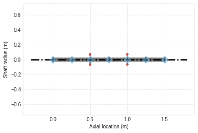
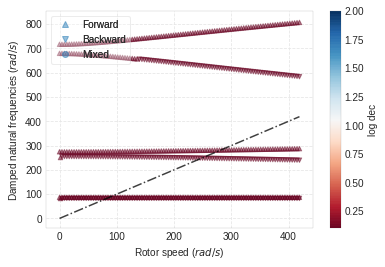

EXAMPLE 5.9.2.
==============

This system is the same as that of Example 5.9.1 except that the
isotropic bearings are replaced by anisotropic bearings. Both bearings
have a stiffness of 1 MN/m in the x direction and 0.8 MN/m in the y
direction. Calculate the eigenvalues and mode shapes at 0 and 4,000
rev/min and plot the natural frequency map for rotational speeds up to
4,500 rev/min.

.. code:: ipython3

    from bokeh.io import output_notebook
    import ross as rs
    import numpy as np
    output_notebook()

.. raw:: html

    
        

            
            Loading BokehJS ...
        

.. code:: ipython3

    #Classic Instantiation of the rotor
    shaft_elements = []
    bearing_seal_elements = []
    disk_elements = []
    Steel = rs.steel
    
    for i in range(6):
        shaft_elements.append(rs.ShaftElement(L=0.25, material=Steel, n=i, i_d=0, o_d=0.05))
        
    disk_elements.append(rs.DiskElement.from_geometry(n=2,
                                                      material=Steel, 
                                                      width=0.07,
                                                      i_d=0.05, 
                                                      o_d=0.28
                                                     )
                        )
    
    disk_elements.append(rs.DiskElement.from_geometry(n=4,
                                                      material=Steel, 
                                                      width=0.07,
                                                      i_d=0.05, 
                                                      o_d=0.35
                                                     )
                        )
    bearing_seal_elements.append(rs.BearingElement(n=0, kxx=1e6, kyy=.8e6, cxx=0, cyy=0))
    bearing_seal_elements.append(rs.BearingElement(n=6, kxx=1e6, kyy=.8e6, cxx=0, cyy=0))
    
    rotor592c = rs.Rotor(shaft_elements=shaft_elements,
                         bearing_seal_elements=bearing_seal_elements,
                         disk_elements=disk_elements,n_eigen = 12)
    
    rotor592c.plot_rotor()

.. raw:: html

    
    
    
    
    
    
      

.. parsed-literal::

    (Figure(id='1003', ...),
     <matplotlib.axes._subplots.AxesSubplot at 0x7f29eb625390>)

.. code:: ipython3

    #From_section class method instantiation.
    bearing_seal_elements = []
    disk_elements = []
    shaft_length_data = 3*[0.5]
    i_d = 3*[0]
    o_d = 3*[0.05]
    
    disk_elements.append(rs.DiskElement.from_geometry(n=1,
                                                      material=Steel, 
                                                      width=0.07,
                                                      i_d=0.05, 
                                                      o_d=0.28
                                                     )
                        )
    
    disk_elements.append(rs.DiskElement.from_geometry(n=2,
                                                      material=Steel, 
                                                      width=0.07,
                                                      i_d=0.05, 
                                                      o_d=0.35
                                                     )
                        )
    bearing_seal_elements.append(rs.BearingElement(n=0, kxx=1e6, kyy=1e6, cxx=0, cyy=0))
    bearing_seal_elements.append(rs.BearingElement(n=3, kxx=1e6, kyy=1e6, cxx=0, cyy=0))
    
    rotor592fs = rs.Rotor.from_section(brg_seal_data=bearing_seal_elements,
                                       disk_data=disk_elements,leng_data=shaft_length_data,
                                       i_ds_data=i_d,o_ds_data=o_d                                  )
    rotor592fs.plot_rotor()

.. raw:: html

    
    
    
    
    
    
      

.. parsed-literal::

    (Figure(id='2244', ...),
     <matplotlib.axes._subplots.AxesSubplot at 0x7f29e913a0b8>)

.. image:: example_05_09_02_files/example_05_09_02_3_3.png

.. code:: ipython3

    #Obtaining results (wn is in rad/s)
    
    print('Normal Instantiation =', rotor592c.wn)
    print('\n')
    print('From Section Instantiation =', rotor592fs.wn)

.. parsed-literal::

    Normal Instantiation = [ 82.65303734  86.65811435 254.52047828 274.31285391 679.48903239
     716.78631221]
    
    
    From Section Instantiation = [ 86.65926451  86.65926451 274.37573752 274.37573752 718.87267817
     718.87267818]

.. code:: ipython3

    #Obtaining results for w=4000RPM (wn is in rad/s)
    
    rotor592c.w=4000*np.pi/30
    
    print('Normal Instantiation =', rotor592c.wn)

.. parsed-literal::

    Normal Instantiation = [ 82.32547398  86.86369902 239.64228361 287.24958074 583.48782916
     806.8872843 ]

.. code:: ipython3

    rotor592c.run_campbell(np.linspace(0,4000*np.pi/30,100)).plot()

.. raw:: html

    
    
    
    
    
    
      

.. parsed-literal::

    (<Figure size 432x288 with 2 Axes>,
     <matplotlib.axes._subplots.AxesSubplot at 0x7f29e90069e8>)

