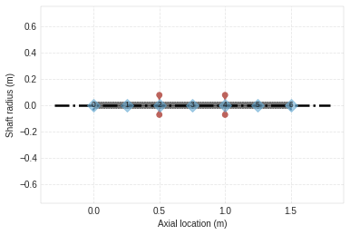
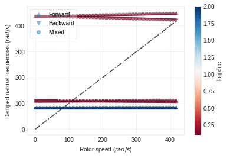

EXAMPLE 5.9.6.
==============

Hydrodynamic Bearings. Repeat the analysis of Example 5.9.1 when the
bearings are replaced with hydrodynamic bearings. The oil-film bearings
have a diameter of 100 mm, are 30 mm long, and each supports a static
load of 525 N, which represents half of the weight of the rotor. The
radial clearance in the bearings is 0.1 mm and the oil film has a
viscosity of 0.1 Pa s. These bearings have the same characteristics as
Example 5.5.1.

.. code:: ipython3

    from bokeh.io import output_notebook
    import ross as rs
    import numpy as np
    output_notebook()

.. raw:: html

    
        

            
            Loading BokehJS ...
        

.. code:: ipython3

    
    #Classic Instantiation of the rotor
    shaft_elements = []
    bearing_seal_elements = []
    disk_elements = []
    Steel = rs.steel
    for i in range(6):
        shaft_elements.append(rs.ShaftElement(L=0.25, material=Steel, n=i, i_d=0, o_d=0.05))
    
    disk_elements.append(rs.DiskElement.from_geometry(n=2,
                                                      material=Steel, 
                                                      width=0.07,
                                                      i_d=0.05, 
                                                      o_d=0.28
                                                     )
                        )
    
    disk_elements.append(rs.DiskElement.from_geometry(n=4,
                                                      material=Steel, 
                                                      width=0.07,
                                                      i_d=0.05, 
                                                      o_d=0.35
                                                     )
                        )
    bearing_seal_elements.append(rs.BearingElement(n=0, kxx=12.81e6,kxy=16.39e6,kyx=-25.06e6, kyy=8.815e6, cxx=232.9e3,cxy=-81.92e3,cyx=-81.92e3, cyy=294.9e3))
    bearing_seal_elements.append(rs.BearingElement(n=6, kxx=12.81e6,kxy=16.39e6,kyx=-25.06e6, kyy=8.815e6, cxx=232.9e3,cxy=-81.92e3,cyx=-81.92e3, cyy=294.9e3))
    
    rotor596c = rs.Rotor(shaft_elements=shaft_elements,
                         bearing_seal_elements=bearing_seal_elements,
                         disk_elements=disk_elements,n_eigen = 12)
    
    rotor596c.plot_rotor()

.. raw:: html

    
    
    
    
    
    
      

.. parsed-literal::

    (Figure(id='1003', ...),
     <matplotlib.axes._subplots.AxesSubplot at 0x7f96c46936d8>)

.. code:: ipython3

    #From_section class method instantiation.
    bearing_seal_elements = []
    disk_elements = []
    shaft_length_data = 3*[0.5]
    i_d = 3*[0]
    o_d = 3*[0.05]
    
    disk_elements.append(rs.DiskElement.from_geometry(n=1,
                                                      material=Steel, 
                                                      width=0.07,
                                                      i_d=0.05, 
                                                      o_d=0.28
                                                     )
                        )
    
    disk_elements.append(rs.DiskElement.from_geometry(n=2,
                                                      material=Steel, 
                                                      width=0.07,
                                                      i_d=0.05, 
                                                      o_d=0.35
                                                     )
                        )
    bearing_seal_elements.append(rs.BearingElement(n=0, kxx=1e6, kyy=1e6, cxx=3e3, cyy=3e3))
    bearing_seal_elements.append(rs.BearingElement(n=3, kxx=1e6, kyy=1e6, cxx=3e3, cyy=3e3))
    
    rotor596fs = rs.Rotor.from_section(brg_seal_data=bearing_seal_elements,
                                       disk_data=disk_elements,leng_data=shaft_length_data,
                                       i_ds_data=i_d,o_ds_data=o_d
                                      )
    rotor596fs.plot_rotor()

.. raw:: html

    
    
    
    
    
    
      

.. parsed-literal::

    (Figure(id='2244', ...),
     <matplotlib.axes._subplots.AxesSubplot at 0x7f96c19bf0f0>)

.. image:: example_05_09_06_files/example_05_09_06_3_3.png

.. code:: ipython3

    #Obtaining results for w = 200 rpm 
    rotor596c.w=200*np.pi/30
    rotor596fs.w=200*np.pi/30
    
    
    
    print('Normal Instantiation =', rotor596c.wn/(2*np.pi),'[Hz]')
    print('\n')
    print('From Section Instantiation =', rotor596fs.wn/(2*np.pi),'[Hz]')

.. parsed-literal::

    Normal Instantiation = [14.65456496 15.00342392 17.29602598 17.6304386  69.39050339 69.45679729] [Hz]
    
    
    From Section Instantiation = [ 13.89569397  13.9153662   47.97597062  48.40830101 136.87265681
     135.61510191] [Hz]

.. code:: ipython3

    #Obtaining results for w=4000RPM 
    
    rotor596c.w=4000*np.pi/30
    
    
    print('Normal Instantiation =', rotor596c.wn/(2*np.pi))

.. parsed-literal::

    Normal Instantiation = [14.65397309 15.00828414 17.08915063 17.78723718 67.06556436 71.29745535]

.. code:: ipython3

    rotor596c.run_campbell(np.linspace(0,4000*np.pi/30,100)).plot()

.. raw:: html

    
    
    
    
    
    
      

.. parsed-literal::

    (<Figure size 432x288 with 2 Axes>,
     <matplotlib.axes._subplots.AxesSubplot at 0x7f96c19949b0>)

