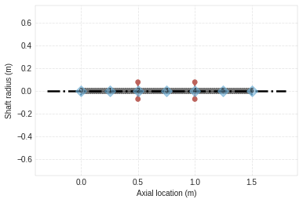
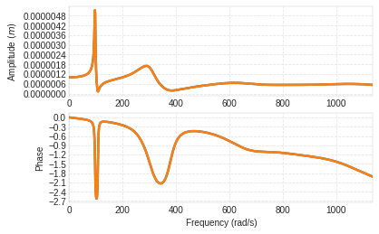

Tutorial
========

`Download This
Notebook <https://ross-rotordynamics.github.io/ross-website/_downloads/51a7c8bd4026689b99005339576b2193/tutorial.ipynb>`__

| This is a basic tutorial on how to properly use ROSS (Rotordynamics
  open-source software), a simulator for rotating machinery. The
  majority of this code follows object-oriented coding, which is
  represented in this `UML
  DIAGRAM <https://user-images.githubusercontent.com/32821252/50386686-131c5200-06d3-11e9-9806-f5746295be81.png>`__.
| In the following topics we are going to discuss the most relevant
  classes for a quick start to use ROSS.

Materials
---------

There is a class called Material to hold material’s properties.

.. code:: ipython3

    import ross as rs
    from bokeh.io import output_notebook
    import numpy as np
    import matplotlib.pyplot as plt
    
    output_notebook()
    
    Steel = rs.Material(name="Steel", rho=7810, E=211e9, G_s=81.2e9)

.. raw:: html

    
        

            
            Loading BokehJS ...
        

| Where: - ‘name’ is a parameter used to identificate the material. -
  ‘rho’ is the density of this material - ‘E’ is the Young’s modulus. -
  ‘G_s’ is the Shear modulus.
| Note that, to instatiate a Material class, you only need to give 2 out
  of the following parameters: ‘E’, ‘G_s’ ,‘rho’.

Saving a Material
~~~~~~~~~~~~~~~~~

To save an already instantiated Material object, you need to use the
following method.

.. code:: ipython3

    Steel.save_material()

Loading a Material
~~~~~~~~~~~~~~~~~~

To load a material, first of all, use the available_materials() method
to check if your material is instantiated, then you should use the
Material.use_material(‘name’) method with the name of the material as a
parameter.

.. code:: ipython3

    rs.Material.available_materials()

.. code-block:: python

    ['AISI4140', 'Steel']

.. code:: ipython3

    steel = rs.Material.use_material('Steel')

Element
-------

| Element is an abstract class(not directly used in the program), this
  class is mainly used to organize the code and make it more intuitive.
| - All the classes which derives from Element ends with Element in
  their respective names. - Every element is placed in a node, which is
  the junction of two elements.

ShaftElement
------------

| There are two methods that you could use to model this element:
| \* Euler–Bernoulli beam Theory \* Timoshenko beam Theory (used as
  default)

| This Element represents the rotor’s shaft, all the other elements are
  correlated with this one.
| This class can be instantiated as the code that follows.
| Where: - ‘i_d’: the shaft’s internal diameter (zero when dealing with
  a solid shaft). - ‘o_d’: the shaft’s outter diameter. - ‘n’: the node
  where the shaft elements starts. - ‘L’: the length of the shaft
  element.

.. code:: ipython3

    i_d = 0
    o_d = 0.05
    n = 6
    l_list = [0.25 for _ in range(n)]
    
    shaft_elements = [rs.ShaftElement(L=l,
                                      i_d=i_d,
                                      o_d=o_d,
                                      material=steel,
                                      shear_effects=True,
                                      rotary_inertia=True,
                                      gyroscopic=True
                                      ) for l in l_list]

DiskElement
-----------

| As the name says this class represents a Disk.
| We can see an example of instantiation of this class in the following
  lines of code.

Where: - ‘n’ is the node where this disk is stored. - ‘Id’ is the
Diametral moment of inertia. - ‘Ip’ is the Polar moment of inertia. -
‘m’ is the mass of the Disk.

All the values are following the S.I. convention.

.. code:: ipython3

    Disk = rs.DiskElement(n=0, m=32.58972765, Id=0.17808928, Ip=0.32956362)
    print(Disk)

.. code-block:: python

    DiskElement(Id=0.17809, Ip=0.32956, m=32.59, color='#bc625b', n=0)

From geometry DiskElement instantiation
~~~~~~~~~~~~~~~~~~~~~~~~~~~~~~~~~~~~~~~

| Besides the instatiation previously explained, there is a way to
  instantiate a DiskElement with only geometrical parameters (for
  cylindrical disks) and the material which this disk is made of, as we
  can see in the following code.
| - ‘n’ is the node where the disk is stored. - ‘i_d’ is the internal
  diameter of the disk(usually it’s the same as the outter diameter of
  the shaft where the disk is placed. - ‘o_d’ is the outter diameter of
  the disk. - ‘material’ is the material which the disk is made of. -
  ‘width’ is the disk’s width

.. code:: ipython3

    disk0 = rs.DiskElement.from_geometry(n=2,
                                         material=steel,
                                         width=0.07,
                                         i_d=0.05,
                                         o_d=0.28)
    disk1 = rs.DiskElement.from_geometry(n=4,
                                         material=steel,
                                         width=0.07,
                                         i_d=0.05,
                                         o_d=0.28)
    disks = [disk0,disk1]

BearingElement
--------------

| As it says on the name, this class is a bearing.
| The following code demonstrate how to properly instantiate it. - ‘n’
  is the node in which the bearing is located. - ‘kxx’ is a stiffness
  coefficient that corresponds to the term from the stiffness matrix. -
  ‘kyy’ is a stiffness coefficient that corresponds to the term from the
  stiffness matrix. - ‘cxx’ is a damping coefficient that corresponds to
  the term from the damping matrix.

P.S.: Note that the coefficients could be an array with different
coefficients for different rotation speeds, in that case you only have
to give a parameter ‘w’ which is a array with the same size as the
coefficients array.

P.S.2: The coefficients are not limitated by kxx and kyy, you can also
give cross-coupled coefficients.

.. code:: ipython3

    stfx = 1e6
    stfy = 0.8e6
    bearing0 = rs.BearingElement(n=0, kxx=stfx, kyy=stfy, cxx=1e3, w=np.linspace(0,200,101))
    bearing1 = rs.BearingElement(n=6, kxx=stfx, kyy=stfy, cxx=1e3, w=np.linspace(0,200,101))
    bearings = [bearing0, bearing1]

Instantiating bearings from excel archives
~~~~~~~~~~~~~~~~~~~~~~~~~~~~~~~~~~~~~~~~~~

There’s a class method to instantiate a bearing from excel tables, as we
can see in the following code.

**There will be a class method to instantiate a bearing from excel
tables. - work in progress**

Rotor
-----

This class unifies all the Element classes in the program and assembles
the mass, damping and stiffness matrices of each element, building up
matrices for the global system. Apart from that, it also outputs all the
results classes obtained by the simulation.

To use this class you only have to give all the already instantiated
elements in a list format, as it follows.

.. code:: ipython3

    rotor1 = rs.Rotor(shaft_elements,
                      disks,
                      bearings 
                      )

From section instantiation of a Rotor
~~~~~~~~~~~~~~~~~~~~~~~~~~~~~~~~~~~~~

| In this form of instantiation, the number of shaft elements used in
  FEM are not fixed, instead, the program does a convergence analysis,
  testing the number of elements to a point where the relative error
  between iterations reaches a value that can be neglected.
| To use this method, you should divide the rotor in a way where the
  number of shaft elements is minimal and place every element (except
  for the shaft elements) in the minimal nodes

.. code:: ipython3

    i_d = 0
    o_d = 0.05
    
    i_ds_data = [0,0,0]
    o_ds_data = [0.05, 0.05, 0.05]
    leng_data = [0.5, 0.5, 0.5]
    
    stfx = 1e6
    stfy = 0.8e6
    bearing0 = rs.BearingElement(n=0, kxx=stfx, kyy=stfy, cxx=1e3, w=np.linspace(0,200,101))
    bearing1 = rs.BearingElement(n=3, kxx=stfx, kyy=stfy, cxx=1e3, w=np.linspace(0,200,101))
    bearings = [bearing0, bearing1]
    
    disk0 = rs.DiskElement.from_geometry(n=1,
                                         material=steel,
                                         width=0.07,
                                         i_d=0.05,
                                         o_d=0.28
                                        )
    disk1 = rs.DiskElement.from_geometry(n=2,
                                         material=steel,
                                         width=0.07,
                                         i_d=0.05,
                                         o_d=0.28
                                        )
    disks = [disk0,disk1]
    
    rotor2 = rs.Rotor.from_section(brg_seal_data=bearings,
                                   disk_data=disks,
                                   i_ds_data=i_ds_data,
                                   leng_data=leng_data,
                                   o_ds_data=o_ds_data, 
                                  )

Visualizing the Rotor
~~~~~~~~~~~~~~~~~~~~~

It is interesting to plot the rotor to check if it’s really what you
wanted to instantiate, you can plot it with the following code.

Note: There are two plots, one with bokeh plot and one with matplotlib,
you can either turn on or off the matplotlib one.

.. code:: ipython3

    rotor1.plot_rotor()

.. raw:: html

    
    
    
    
    
    
      

.. code-block:: python

    (Figure(id='1003', ...),
     <matplotlib.axes._subplots.AxesSubplot at 0x7f5ac9c67a20>)

Running the simulation
~~~~~~~~~~~~~~~~~~~~~~

After you verify that everything is fine with the rotor, you should run
the simulation and obtain results. To do that you only need to use the
run() method like the code bellow.

.. code:: ipython3

    rotor1.run_modal()
    rotor2.run_modal()

Obtaining results
-----------------

These are the following analysis you can do with the program: - Static
analysis - Campbell Diagram - Frequency response - Forced response -
Mode Shapes

Static analysis
~~~~~~~~~~~~~~~

This method gives a free body diagram and a exagerated plot of the rotor
response to gravity effects.

.. code:: ipython3

    rotor1.run_static()

.. code-block:: python

    StaticResults([array([-0.00054047, -0.00091442, -0.00118923, -0.00128644, -0.00118923,
           -0.00091442, -0.00054047]),
                   array([ 2.94875235e-12, -4.32377431e+02, -3.94782008e+02, -3.57186586e+02,
           -3.75954221e+01, -2.74269496e-12,  3.75954221e+01,  3.57186586e+02,
            3.94782008e+02,  4.32377431e+02,  2.94875235e-12]),
                   array([ 0.00000000e+00, -1.03394930e+02, -1.97391004e+02, -2.02090432e+02,
           -1.97391004e+02, -1.03394930e+02, -3.97903932e-12]),
                   {'Shaft Total Weight': '225.6', 'Disks Forces': ['-319.6', '-319.6'], 'Bearings Reaction Forces': ['432.4', '432.4']}],
                  dtype=object)

Campbell Diagram
~~~~~~~~~~~~~~~~

In this example we can see the campbell diagram from 0 to 4000 RPM.

.. code:: ipython3

    campbell = rotor1.run_campbell(np.linspace(0,200,101))
    campbell.plot()

.. raw:: html

    
    
    
    
    
    
      

.. code-block:: python

    (<Figure size 432x288 with 2 Axes>,
     <matplotlib.axes._subplots.AxesSubplot at 0x7f5ac8b36278>)

.. image:: tutorial_files/tutorial_31_3.png

Frenquency Response
~~~~~~~~~~~~~~~~~~~

We can put the frequency response of

.. code:: ipython3

    rotor1.run_freq_response().plot(inp=0,out=0)
    plt.rcParams["figure.figsize"] = (15,10)

.. raw:: html

    
    
    
    
    
    
      

