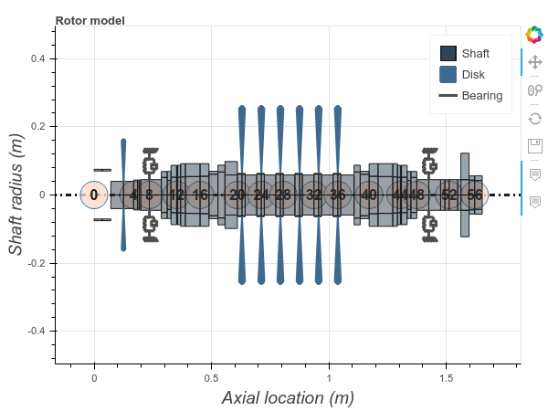
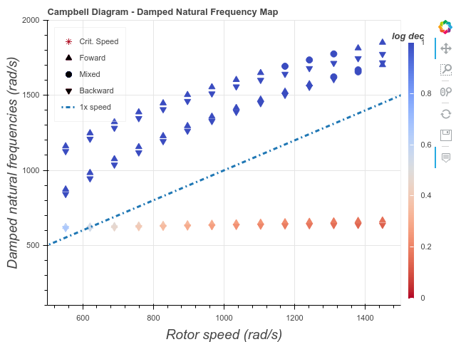

# Summary

There are several critical rotating equipment crucial to the industry, such as compressors, 
pumps and turbines.
Computational mechanical models aim to simulate the behavior of such mechanical
systems [@friswell2010dynamics; @vance2010machinery; @childs1993turbomachinery; @ishida2012linear; @gasch2006rotordynamik]. 
These models are used to support research and decision making. To this purpose, we present ROSS, 
an open source library written in Python for rotordynamic analysis.

Concerning rotordynamics softwares, there are some commercial finite element softwares that have a rotordynamic 
module [@comsol; @ansys], some softwares based on a commercial platform (Matlab) [@madyn; @dynamicsrotating], and others 
that are independent [@rotorinsa; @trcsoftware]. 
To use these softwares one needs to buy licenses, and they are not intended to be developed in a collaborative public 
manner.

ROSS allows the construction of rotor models and their numerical simulation. Shaft elements, as a default, are 
modeled with the Timoshenko beam theory, which considers shear and rotary inertia effects, and discretized by means of 
the Finite Element Method [@friswell2010dynamics]. Disks are assumed to be rigid bodies, thus their strain energy is not taken 
into account. And bearings/seals are included as linear stiffness/damping coefficients.

After defining the element matrices and assembling the global matrices of the system, ROSS draws the rotor geometry, 
runs simulations, and obtains results in the form of graphics. It performs several analyses, such as static analysis, 
Campbell Diagram, mode shapes, frequency response, and time response.

The general form of the equation for the system, after matrix assembly is

\begin{equation}\label{eq:general-form}
   \mathbf{M \ddot{q}}(t)
  + \mathbf{C}(\Omega) \mathbf{\dot{q}}(t)
  + \omega \mathbf{G} \mathbf{\dot{q}}(t)
  + \mathbf{K}(\Omega) \mathbf{{q}}(t)
  = \mathbf{f}(t)\,,
\end{equation}

where $\textbf{q}$ is the generalized coordinates of the system (displacements and rotations), 
$\mathbf{M}$, $\mathbf{K}$, $\mathbf{C}$ and $\mathbf{G}$ are the mass, stiffness, damping and gyroscopic 
matrices, $\Omega$ is the excitation frequency, $\omega$ is the rotor whirl speed and $\mathbf{f}$ is the generalized 
force vector.

We have built the package using main Python packages such as NumPy [@van2011numpy], SciPy [@jones2001scipy] 
and Bokeh [@bokeh2019].

Besides the [documentation](https://ross-rotordynamics.github.io/ross-website/), a set of Jupyter Notebooks 
is available for the tutorial and some examples. Users can also access these notebooks through a [Binder server](https://mybinder.org/v2/gh/ross-rotordynamics/ross/master).

As an example, Figure 1 shows a centrifugal compressor modeled with ROSS. 

The shaft elements are in gray, 
the impellers represented as disks are in blue and the bearings are displayed as springs and dampers. This plot is generated with Bokeh, 
and we can use the hover tool to get additional information on each element.

One analysis that can be carried out is the modal analysis. Figure 2 shows the Campbell Diagram generated for this 
compressor; the natural frequencies and the log dec vary with the machine rotation speed.

The Campbell Diagram is one of the results that can be obtained from the model, other types of analysis can be found 
on the [documentation](https://ross-rotordynamics.github.io/ross-website/). The software is extensible and new elements 
or new types of analysis can be easily included.

# Acknowledgements
We acknowledge that ROSS development is supported by Petrobras, Universidade Federal do Rio de Janeiro (UFRJ) and 
Agência Nacional de Petróleo, Gás Natural e Biocombustíveis (ANP).

# References