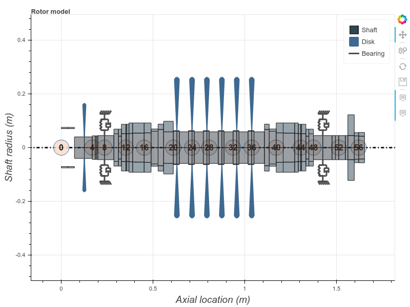

# Summary

There are several critical rotating equipment crucial to the industry, such as compressors, 
pumps and turbines.
Computational mechanical models aim to simulate the behavior of such mechanical
systems, and to support decision making. To this purpose, we present ROSS, an open source
library written in Python for rotordynamic analysis.

ROSS allows modeling finite elements for components such as shafts, disks, and bearings, 
and join them in order to construct rotors. It is possible to plot the rotor geometry, 
run simulations, and obtain results in the form of graphics, by performing Static analysis, Campbell Diagram,
Frequency response, Forced response, and Mode Shapes.

As an example, Figure 1 shows a centrifugal compressor modeled with ROSS. The shaft elements are in gray, 
the disks are in blue and the bearings are displayed as springs and dampers.

In this case we used Timoshenko beam theory to model the shaft elements as described by [@friswell2010dynamics].

Figure 2 shows the Campbell Diagram generated for this compressor.

# References